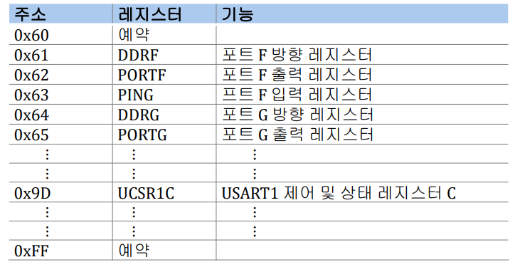
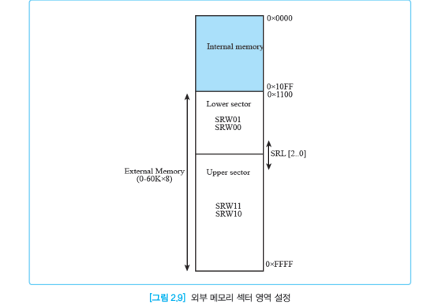
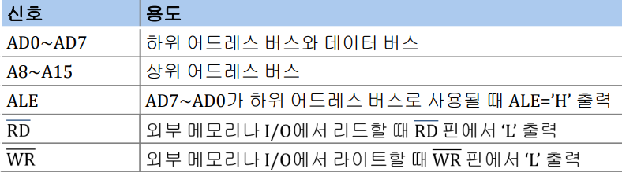

## AVR
- Atmel에서 개발한 8비트 RISC 마이크로 컨트롤러
- Advanced Virtual RISC” 또는 “Alf-egil bogen & Vegard wollan’s advanced RISC” 의 약자
- 하버드 구조를 채택한 RISC 기반 설계로 고속의 명령어 처리 가능
- 플래쉬 메모리를 내장하여 ISP(In-System Programming) 기능 지원
  

## ISP

- ISP(In-System Programming)는 AVR 칩을 PCB 보드에 실장한 후 전원, 클럭 등의 최소한의 소자만으로 AVR 칩에 프로그래밍이 가능하도록 지원하는 기능
- 마이크로컨트롤 칩에 지원하는 보편화된 기능
   

## ATmega128의 핀기능
- 64개 핀으로 구성
- 패키지는 :  TQFP(Thin Quad Flat Package),  MLF(Micro Lead Frame)

##  ATmega128의 내부 구조

## AVR코어

- 명령어 인출(fetch)하여 해독(decode)

- 구성 요소
  - 프로그램 카운터
  - 명령어 해독기
  - ALU
    - 산술연산, 논리연산, 비트연산을 수행
    - ALU의 연산은 대부분 1 클럭 사이클에서 수행됨

  - 범용 레지스터
    - 32개의 8비트 범용 레지스터(R0~R31) 
  
  - 상태 레지스터
    - ALU에서 가장 최근 실행된 산술연산 결과에 대한 상태를 나타냄
  
  - 스택 포인터
  - SRAM, EEPROM
  - 인터럽트 처리기 등

  - X, Y, Z 레지스터
    - 데이터 메모리의 어드레스 포인터로 사용
      - 16비트 어드레스를 간접 지정하는 어드레스 포인터
    - 8비트 범용 레지스터 R0~R31 중 R26~R31를 2개씩 취하여 3개의
      - 16비트 레지스터 X, Y, Z 레지스터로 사용
  

## 프로그램 메모리
   - 어드레스 버스는 16비트이므로 65536(≈2^(16))개의 어드레스를 갖고 128KB(=64K×16비트) 메모리 구조를 갖음
   - SPI 시리얼 통신 방식을 이용한 ISP(In-System Programming) 기능으로 프로그램을 쉽게 플래쉬 메모리에 라이트할 수 있음
     - 플래쉬 메모리는 10,000번까지 라이트 가능
     -  JTAG 인터페이스 또는 병렬 프로그래밍 모드로 플래쉬 메모리에 라이트 가능
  - 부트 프로그램 섹션(부트 로더 섹션)과 응용 프로그램 섹션으로 나뉨

  

  ## 데이터 메모리

  
  - 32개의 레지스터 파일
  - 64개의 I/O 레지스터
  - 160개의 확장 I/O 레지스터
  - 4KB의 내부 SRAM
  - 외부 데이터 메모리
  - EEPROM
    - 별도의 레지스터로 엑세스

## I/O 레지스터

- ATmega128의 내장된 I/O 장치를 동작시키기 위해 사용되는 레지스터

## SRAM
- 4KB의 SRAM의 번지 값는 직접 지정하거나 X, Y, Z 레지스터를 사용하여 간접 지정하여 엑세스

## 외부 데이터 메모리
-   ATmega128은 60KB(0x1100~0xFFFF 번지) 영역을 외부 데이터 메모리로 사용
- 외부 데이터 메모리로 SRAM이나 I/O 장치로 사용할 수 있음

## EEPROM
- 100,000번까지 라이트할 수 있는 4KB의 EEPROM 내장
- 다른 메모리와 별개로 0x0000~0x0FFF 번지로 할당되어 있음
  -  별도의 레지스터로 엑세스

 ---- 
- ATmega128은 60KB(0x1100 ~0xFFFF)영역을 외부 SRAM이나 I/O 장치로 사용

  

- 외부 인터페이스에 사용되는 ATmega128의 핀

  
