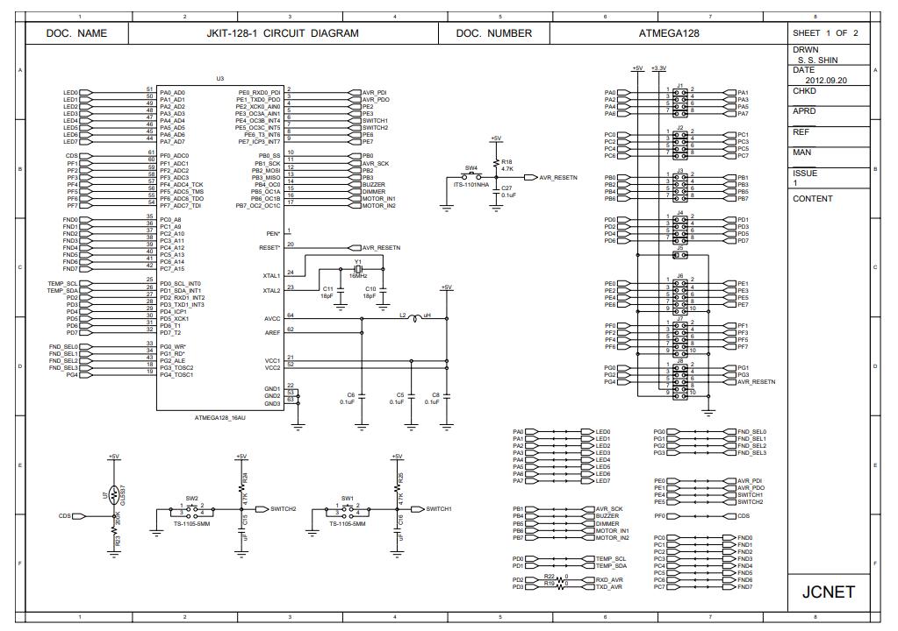
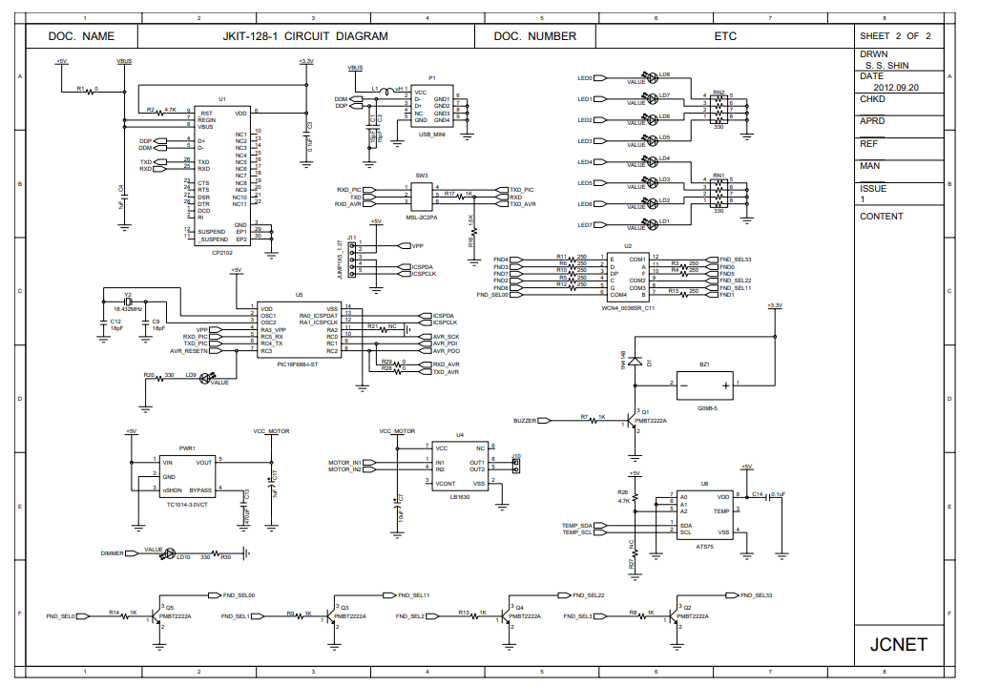

# Atmega128

[1.MicroProcessor](1.Microprocessor/Microprocessor)
[2. AVR](./2.AVR/AVR)
[3. I/O PORT](3.IOport/IOport)
[4. Instruction](./4.Instruction/Instruction)
[5. interrupt](5.Interrupt/Interrupt)
[6. CounterTimer](6.CounterTimer/CounterTimer)
[7. Buzzer](./7.Buzzer/7.Buzzer)
[8. UART](./8.UART/8.UART)
[9. AD_Converter](./9.AD_Converter/AD_Converter)
[10. PWM](./10.PWM/PWM)
[11. Serial통신](./11.Serial/Serial)

![[회로도2.png]]

